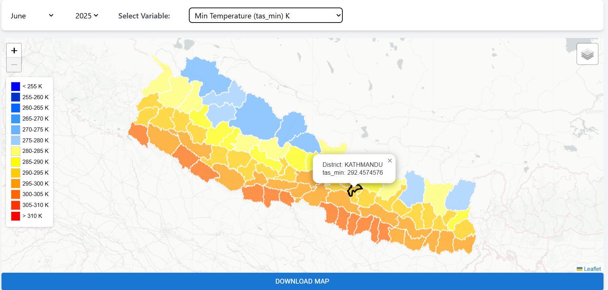
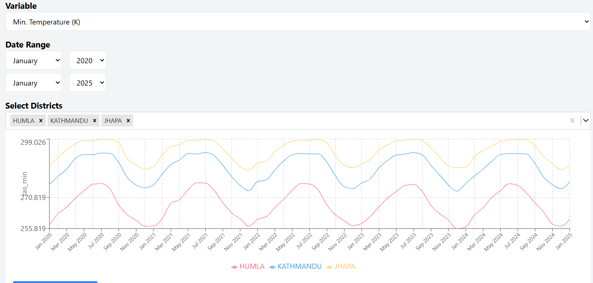
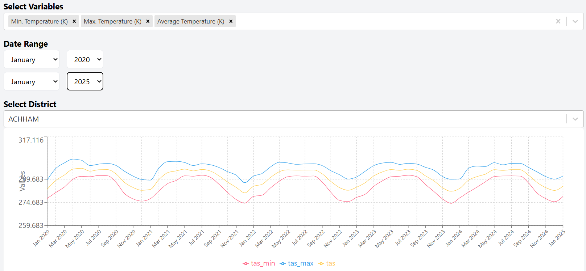
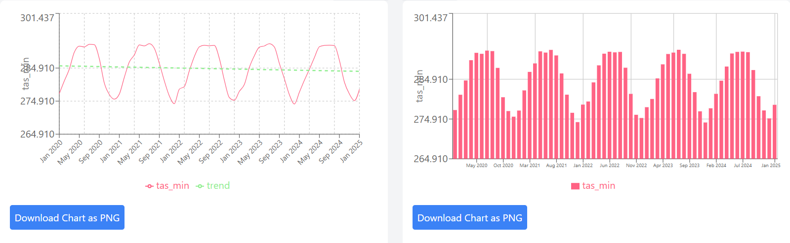
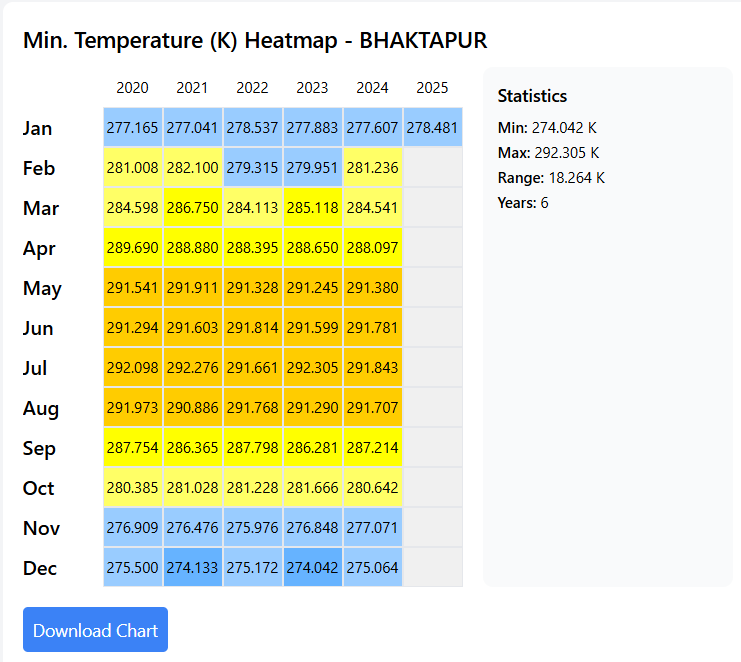
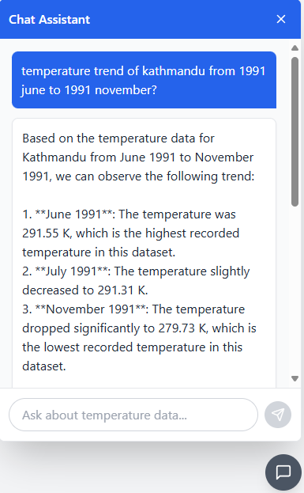

# Climate Geospatial Analysis & Prediction 

An interactive platform for analyzing and predicting climate patterns in Nepal using geospatial data, machine learning, and an AI-powered chatbot.

## Features

- **Interactive Map** — District-level climate data visualization  
- **Trend Analysis** — View historical and forecasted climate data through dynamic charts  
- **Comparative Tools** — Compare variables across districts and time  
- **AI Chatbot** — Query climate info using natural language

## Tech Stack

- **Frontend**: React.js, LeafletJS, Chart.js  
- **Backend**: Node.js, Express.js  
- **Database**: PostgreSQL + PostGIS  
- **AI**: RAG (text-embedding-ada-002 + GPT-4o)

## Screenshots
Map Visualization

Comparison

Charts

Chatbot Interaction
